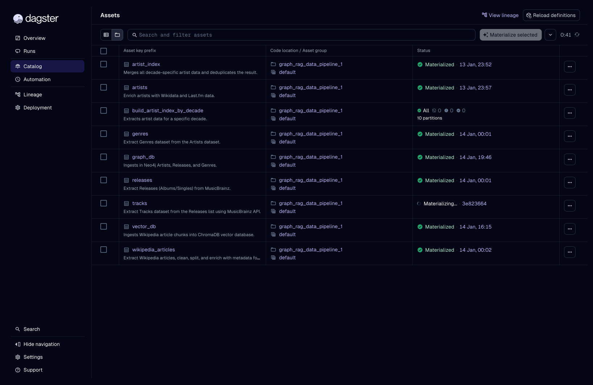
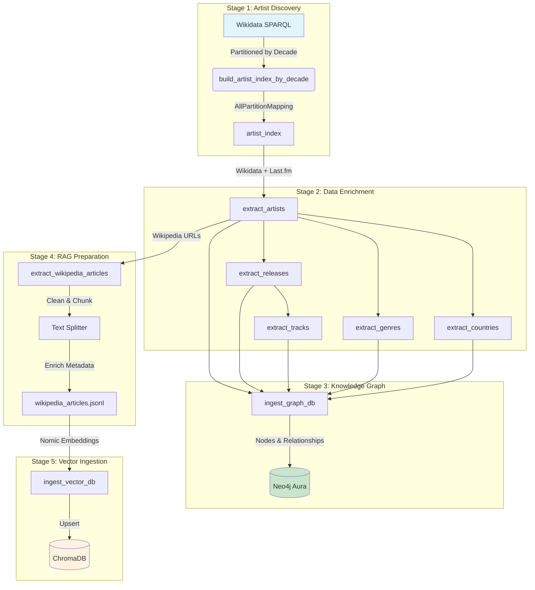
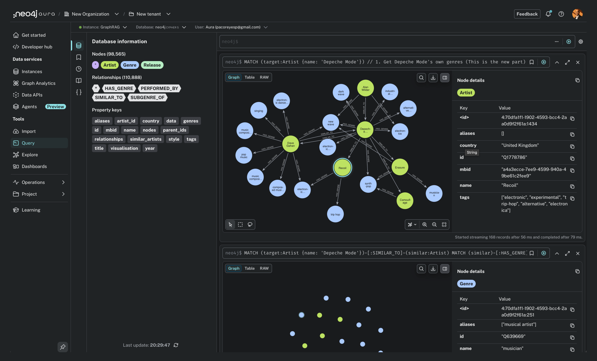
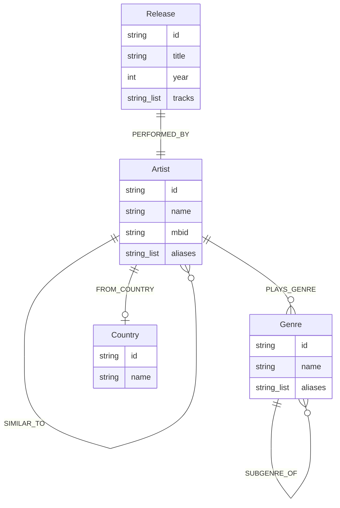

# GraphRAG - Part 1: Data Pipeline

*Last update: January 18, 2026*

This repo is part of a larger project **GraphRAG** app, in which I show how the GraphRAG pattern works.

Part 1 is a basic Data Pipeline made with **Dagster**, which orchestrates the data ingestion from multiple sources for making a knowledge graph (in **Neo4j** graph database) and an embedding model (in **ChromaDB** vector database) for a RAG system. This app is ready to be deployed on the cloud in a Docker container.

## Domain: Electronic Music

This pipeline is specifically tuned for the **Electronic Music** domain. It captures the rich, interconnected history of electronic artists, from early pioneers to contemporary producers. The dataset encompasses a wide range of sub-genres—including Techno, House, Ambient, IDM, and Drum & Bass—modeling the complex relationships between artists, their releases, and the evolving taxonomy of electronic musical styles.


## About the Project

This data pipeline orchestrates data ingestion from multiple sources to build a rich dataset of music artists:

* **Structured Data**
  - **Wikidata API** (Artists & Genres—using SPARQL & Action API)
  - **Last.fm API** (Similar Artists & Tags)
  - **MusicBrainz API** (Releases & Tracks)
* **unstructured Data**
  - **Wikipedia API** (Articles about Artists and Genres)


The goal is to prepare unstructured data (Wikipedia articles of musicians, bands, and artists) and split it into chunks enriched with structured metadata. This prepares the data for a hybrid search approach:

1.  **Semantic Search:** Preparing text chunks for vectorization.
2.  **Deterministic Search:** Using **Neo4j** (Graph Database).

We leverage **Polars** for high-performance data transformation, **Pydantic** for rigorous data validation, and **Dagster Resources** for clean infrastructure management.

## Tech Stack

- **Orchestration:** [Dagster](https://dagster.io/) (Assets, Resources, Partitions, Asset Checks, I/O Managers)
- **Databases:** [Neo4j](https://neo4j.com/) (Graph), [ChromaDB](https://www.trychroma.com/) (Vector)
- **Data Engineering:** [Polars](https://pola.rs/) (manipulation), [Msgspec](https://github.com/jcrist/msgspec) (serialization), [Ftfy](https://github.com/rspeer/python-ftfy) (cleaning)
- **Data Validation & Config:** [Pydantic](https://pydantic.dev/), [Pydantic Settings](https://docs.pydantic.dev/latest/concepts/pydantic_settings/)
- **AI & ML:** [PyTorch](https://pytorch.org/), [Transformers](https://huggingface.co/docs/transformers/index), [Sentence Transformers](https://www.sbert.net/), [Nomic](https://atlas.nomic.ai/) (Embeddings), [LangChain](https://www.langchain.com/) (Text Splitters), [Einops](https://einops.rocks/)
- **Networking & Utils:** [curl-cffi](https://github.com/yifeikong/curl_cffi) (Async HTTP with browser impersonation), [Structlog](https://www.structlog.org/), [Tqdm](https://tqdm.github.io/)
- **Cloud:** [Dagster GCP](https://docs.dagster.io/integrations/gcp) (Google Cloud Platform integration)
- **Language & Tooling:** [Python 3.13+](https://www.python.org/), [uv](https://docs.astral.sh/uv/), [Ruff](https://docs.astral.sh/ruff/), [Ty](https://github.com/astral-sh/ty), [Bandit](https://bandit.readthedocs.io/)

---

## Architecture Overview

This project implements a **strict separation of concerns** following Dagster's philosophy, dividing the codebase into distinct layers with clear responsibilities.

### Architecture Visualization

```
┌──────────────────────────────────────────────────────────────────────────────┐
│                         DAGSTER DEFINITIONS LAYER                            │
│                    "The How" - Infrastructure & Configuration                │
│  ┌─────────────────┐  ┌─────────────────┐  ┌─────────────────────────────┐  │
│  │  definitions.py │  │   resources.py  │  │     io_managers.py          │  │
│  │  (Entry Point)  │  │ (Factories/DI)  │  │ (Parquet/JSONL Persistence) │  │
│  └────────┬────────┘  └────────┬────────┘  └────────────┬────────────────┘  │
│           │                    │                        │                   │
│  ┌────────┴────────┐  ┌────────┴────────┐  ┌───────────┴───────────┐       │
│  │   checks.py     │  │  partitions.py  │  │    settings.py        │       │
│  │ (Quality Gates) │  │  (By Decade)    │  │ (pydantic-settings)   │       │
│  └─────────────────┘  └─────────────────┘  └───────────────────────┘       │
└──────────────────────────────────────────────────────────────────────────────┘
                                    │
                                    ▼
┌──────────────────────────────────────────────────────────────────────────────┐
│                          ASSET LAYER (defs/assets/)                          │
│                   "The What" - Business Logic & Transformation               │
│  ┌────────────────┐  ┌──────────────────┐  ┌────────────────────────┐       │
│  │ build_artist   │  │  extract_artists │  │  extract_releases      │       │
│  │ _index.py      │──▶│  .py             │──▶│  .py                   │       │
│  │ (Wikidata)     │  │  (Wikidata+Last) │  │  (MusicBrainz)         │       │
│  └────────────────┘  └────────┬─────────┘  └───────────┬────────────┘       │
│                               │                        │                    │
│  ┌────────────────────────────┼────────────────────────┤                    │
│  │                            ▼                        ▼                    │
│  │  ┌──────────────────┐  ┌────────────────┐  ┌─────────────────────┐       │
│  │  │ extract_genres   │  │ extract_tracks │  │ extract_countries   │       │
│  │  │ .py              │  │ .py            │  │ .py                 │       │
│  │  └──────────────────┘  └────────────────┘  └─────────────────────┘       │
│  │                                                                          │
│  │  ┌────────────────────────────────────────────────────────────────────┐  │
│  │  │  ┌─────────────────────┐                 ┌───────────────────┐     │  │
│  │  │  │ extract_wikipedia   │                 │  ingest_vector_db │     │  │
│  │  │  │ _articles.py        │────────────────▶│  .py (ChromaDB)   │     │  │
│  │  │  └─────────────────────┘                 └───────────────────┘     │  │
│  │  │                                                                    │  │
│  │  │  ┌───────────────────┐                                             │  │
│  │  │  │  ingest_graph_db  │◀── artists, releases, tracks,              │  │
│  │  │  │  .py (Neo4j)      │    genres, countries                       │  │
│  │  │  └───────────────────┘                                             │  │
│  │  └────────────────────────────────────────────────────────────────────┘  │
│  └──────────────────────────────────────────────────────────────────────────│
└──────────────────────────────────────────────────────────────────────────────┘
                                    │
                                    ▼
┌──────────────────────────────────────────────────────────────────────────────┐
│                         UTILITIES LAYER (utils/)                             │
│                   Domain-Agnostic, Reusable Components                       │
│  ┌─────────────────────────────────────────────────────────────────────┐    │
│  │                    NETWORK & I/O PRIMITIVES                         │    │
│  │  ┌─────────────────────┐  ┌────────────────────────────────────┐   │    │
│  │  │  network_helpers.py │  │      io_helpers.py                 │   │    │
│  │  │  (HTTP retries,     │  │  (JSON/text files,                 │   │    │
│  │  │   concurrency)      │  │   cache key generation)            │   │    │
│  │  └─────────────────────┘  └────────────────────────────────────┘   │    │
│  └─────────────────────────────────────────────────────────────────────┘    │
│  ┌─────────────────────────────────────────────────────────────────────┐    │
│  │                      DOMAIN ADAPTERS (API Clients)                  │    │
│  │  ┌─────────────────┐  ┌─────────────────┐  ┌─────────────────┐     │    │
│  │  │ wikidata_       │  │ musicbrainz_    │  │ lastfm_         │     │    │
│  │  │ helpers.py      │  │ helpers.py      │  │ helpers.py      │     │    │
│  │  └─────────────────┘  └─────────────────┘  └─────────────────┘     │    │
│  │  ┌─────────────────┐  ┌─────────────────┐  ┌─────────────────┐     │    │
│  │  │ wikipedia_      │  │ neo4j_          │  │ chroma_         │     │    │
│  │  │ helpers.py      │  │ helpers.py      │  │ helpers.py      │     │    │
│  │  └─────────────────┘  └─────────────────┘  └─────────────────┘     │    │
│  └─────────────────────────────────────────────────────────────────────┘    │
│  ┌─────────────────────────────────────────────────────────────────────┐    │
│  │                     DATA TRANSFORMATION                              │    │
│  │  ┌───────────────────────────────────────────────────────────────┐  │    │
│  │  │  data_transformation_helpers.py                                │  │    │
│  │  │  (Text normalization, deduplication, Unicode fixing)           │  │    │
│  │  └───────────────────────────────────────────────────────────────┘  │    │
│  └─────────────────────────────────────────────────────────────────────┘    │
└──────────────────────────────────────────────────────────────────────────────┘
```


## Separation of Concerns

The architecture strictly separates **"The What"** (business logic) from **"The How"** (infrastructure), following Dagster best practices.

### 1. The `assets/` Folder: "The What" (Business Logic)

This folder contains the **Data Definition Graph**.

| Aspect | Description |
|--------|-------------|
| **Role** | Defines *what* data exists, *how* it is computed, and its dependencies |
| **Content** | Pure transformation logic. Takes data in (as parameters) and returns data out (as return values) |
| **Change Frequency** | **High**. This is where you edit code when business requirements change |
| **Dagster Rule** | Assets are unaware of *where* they run or *where* data is stored. They "ask" for a resource and "return" a dataframe |

**Key Design Patterns:**
- Assets return `pl.LazyFrame`, `list[Model]`, or `MaterializeResult` — never write files directly
- Domain-specific constants (e.g., `WIKIDATA_PROP_GENRE = "P136"`) belong in assets, not utils
- Validation logic and business rules are implemented within assets
- Assets delegate parsing/filtering to helper modules for reusability

### 2. The `defs/` Root Files: "The How" (Infrastructure)

These files define the **Execution Environment**.

| File | Role | Change Frequency |
|------|------|-----------------|
| `resources.py` | Connection factories (Neo4j, HTTP clients, ChromaDB). Handles secrets, timeouts, connection pooling | Low |
| `io_managers.py` | Bridge between Python memory and File System/Cloud Storage. Handles serialization (JSONL vs Parquet) and path organization | Low |
| `partitions.py` | Slicing strategy. Defines the "shape" of pipeline execution (by decade) | Low |
| `checks.py` | Quality contracts. Defines rules the data must obey after materialization | Medium |

**Key Design Patterns:**
- **Explicit Resource Factories**: Resources expose `get_client()` context managers rather than implicit lifecycle hooks
- **Secrets via EnvVar**: `resources.py` uses `EnvVar("NEO4J_PASSWORD")` for secrets, not `settings.py`
- **Streaming I/O**: `io_managers.py` uses `sink_parquet()` for LazyFrames (O(1) memory)

### 3. The `utils/` Folder: "The How-To" (Reusable Logic)

Contains **domain-agnostic, reusable helpers** that can be used across different projects.

| Module | Responsibility | Key Functions |
|--------|---------------|---------------|
| `network_helpers.py` | HTTP requests with exponential backoff, concurrency control, async generators | `make_async_request_with_retries()`, `run_tasks_concurrently()`, `yield_batches_concurrently()` |
| `io_helpers.py` | JSON/text file I/O, cache key generation, async file operations | `async_read_json_file()`, `async_write_json_file()`, `generate_cache_key()` |
| `data_transformation_helpers.py` | Text normalization, Unicode fixing (ftfy), Polars expressions | `normalize_and_clean_text()`, `deduplicate_by_priority()` |
| `wikidata_helpers.py` | Wikidata SPARQL & Action API adapter with caching | `run_extraction_pipeline()`, `async_fetch_wikidata_entities_batch()`, `extract_wikidata_*()` |
| `wikipedia_helpers.py` | Wikipedia API adapter with section parsing | `async_fetch_wikipedia_article()`, `parse_wikipedia_sections()` |
| `musicbrainz_helpers.py` | MusicBrainz API adapter with pagination and filtering | `fetch_artist_release_groups_async()`, `filter_release_groups()`, `select_best_release()`, `parse_release_year()` |
| `lastfm_helpers.py` | Last.fm API adapter with response parsing | `async_fetch_lastfm_data_with_cache()`, `parse_lastfm_artist_response()` |
| `neo4j_helpers.py` | Generic Cypher execution with retry logic | `execute_cypher()`, `clear_database()` |
| `chroma_helpers.py` | ChromaDB embedding utilities | `NomicEmbeddingFunction`, `get_device()`, `generate_doc_id()` |

**Design Rules for Utils (CLAUDE.md Compliance):**
- **No global config**: Utils never import `settings` directly — configuration is passed as arguments
- **Dependency injection**: API keys, paths, URLs, timeouts passed as function parameters
- **No domain logic**: Schema definitions (like Neo4j indexes) belong in assets, not utils
- **100% reusable**: All helpers can be used across different projects without modification

### The "Use" Hierarchy

```
┌─────────────────────────────────────────────────────────────────────┐
│  1. RESOURCES (defs/resources.py)                                   │
│     Provide raw connections (AsyncClient, Neo4j Driver, ChromaDB)   │
│                              │                                      │
│                              ▼                                      │
│  2. UTILS (utils/*.py)                                              │
│     Use connections to perform specific actions                     │
│     (fetch_sparql_query, parse_lastfm_artist_response)              │
│                              │                                      │
│                              ▼                                      │
│  3. ASSETS (defs/assets/*.py)                                       │
│     Orchestrate Utils to achieve business goals                     │
│     (Extract Artists, Build Knowledge Graph, Ingest Vector DB)      │
│                              │                                      │
│                              ▼                                      │
│  4. I/O MANAGERS (defs/io_managers.py)                              │
│     Persist asset outputs to storage (Parquet, JSONL)               │
│                              │                                      │
│                              ▼                                      │
│  5. CHECKS (defs/checks.py)                                         │
│     Verify final output quality and data trust                      │
└─────────────────────────────────────────────────────────────────────┘
```

---

## Data Architecture

The pipeline transforms raw data from external APIs into two optimized formats: a **Knowledge Graph** (for structural queries) and **Vector-Ready Text Chunks** (for semantic search).

### Pipeline Flow





### Asset Dependency Graph

| Asset | Input Dependencies | Output Type | I/O Manager |
|-------|-------------------|-------------|-------------|
| `build_artist_index_by_decade` | None (Wikidata SPARQL) | `pl.LazyFrame` | Parquet |
| `artist_index` | `build_artist_index_by_decade` (all partitions) | `pl.LazyFrame` | Parquet |
| `artists` | `artist_index` | `list[Artist]` | Parquet |
| `genres` | `artists` | `pl.LazyFrame` | Parquet |
| `releases` | `artists` | `list[Release]` | Parquet |
| `tracks` | `releases` | `list[Track]` | Parquet |
| `countries` | `artists` | `list[Country]` | Parquet |
| `wikipedia_articles` | `artists`, `genres`, `artist_index` | `list[list[Article]]` | JSONL |
| `graph_db` | `artists`, `releases`, `tracks`, `genres`, `countries` | `MaterializeResult` | None (sink) |
| `vector_db` | `wikipedia_articles` | `MaterializeResult` | None (sink) |

### Partitioning Strategy

The pipeline uses **decade-based partitioning** for the initial artist discovery phase:

```python
DECADES_TO_EXTRACT = {
    "1930s": (1930, 1939),
    "1940s": (1940, 1949),
    "1950s": (1950, 1959),
    "1960s": (1960, 1969),
    "1970s": (1970, 1979),
    "1980s": (1980, 1989),
    "1990s": (1990, 1999),
    "2000s": (2000, 2009),
    "2010s": (2010, 2019),
    "2020s": (2020, 2029),
}
```

**Benefits:**
- Parallelizes SPARQL queries across decades (10 concurrent runs)
- Provides natural checkpointing (failed decade can be retried independently)
- Keeps memory usage constant O(1) regardless of total dataset size

---

### 1. Unstructured Data (RAG Preparation)

We process Wikipedia articles to create a high-quality corpus for Retrieval-Augmented Generation (RAG).

- **Ingestion:** Fetches full articles for every valid artist found in the Knowledge Graph.
- **Cleaning:** Removes Wiki-markup, references, and non-text elements (using excluded headers).
- **Chunking:** Splits text into 2048-token windows with 512-token overlap using a recursive character splitter (offloaded to threads for performance).
- **Enrichment:** Each chunk is "stamped" with global metadata (Genre, Year, Artist Name) to allow for hybrid filtering during retrieval (e.g., "Find chunks about 'Techno' from the '90s").

| Field | Type | Description |
| :--- | :--- | :--- |
| `article` | String | The enriched text content prepended with `search_document:`. |
| `metadata` | JSON | Contextual tags: `title`, `artist_name`, `genres`, `inception_year`, `wikipedia_url`. |

### 2. Graph Database (Neo4j)

We construct a deterministic Knowledge Graph to map the relationships between the musical entities. This allows for precise multi-hop queries (e.g., "Find all sub-genres of 'House' that originated in 'France'").



#### Graph Schema


#### Nodes (Entities)
- **Artist:** The core entity (e.g., "Daft Punk").
- **Release:** Major releases (Albums/Singles) linked to artists. Contains embedded track list as a property.
- **Genre:** A hierarchical taxonomy of musical styles (e.g., "French House" -> "House" -> "Electronic").
- **Country:** Geographic entities representing artist origin (e.g., "France", "Germany").

#### Edges (Relationships)
- `(Artist)-[:PLAYS_GENRE]->(Genre)`
- `(Artist)-[:SIMILAR_TO]->(Artist)`: Derived from Last.fm community data.
- `(Artist)-[:FROM_COUNTRY]->(Country)`: Artist's country of origin.
- `(Release)-[:PERFORMED_BY]->(Artist)`
- `(Genre)-[:SUBGENRE_OF]->(Genre)`: Enables hierarchical graph traversal.

**Dataset Statistics:**
- **Articles:** ~4,679 processed.
- **Nodes:** ~47,584 (Artists, Releases, Genres, Countries).
- **Edges:** ~88,828.

### 3. Vector Database (ChromaDB)

To enable semantic search, the processed text chunks are indexed in **ChromaDB**.

- **Collection Name:** `music_rag_collection`
- **Embedding Model:** `nomic-embed-text-v1.5` (via Nomic AI)
- **Distance Metric:** Cosine Similarity
- **Device Support:** Automatic detection of CUDA, MPS (Apple Silicon), or CPU

The `ingest_vector_db` asset reads from `wikipedia_articles.jsonl`, generates embeddings using the Nomic model with automatic GPU/MPS acceleration, and upserts them into the vector store. This allows for natural language queries like "Which electronic artists were influenced by 80s synth-pop?".


---

## Advanced Design Patterns

### Lazy Evaluation & Streaming

The pipeline enforces **lazy evaluation** throughout to ensure O(1) memory usage:

```python
# Assets return LazyFrames, not eager DataFrames
@asset
def artist_index(...) -> pl.LazyFrame:
    return clean_lf  # Never .collect() inside asset

# I/O Managers handle streaming writes
class PolarsParquetIOManager:
    def handle_output(self, context, obj):
        if isinstance(obj, pl.LazyFrame):
            obj.sink_parquet(path)  # Stream directly to disk
```

### Sparse JSONL Output

For the RAG dataset, we use **sparse JSON** to minimize storage:

```python
# Only non-null fields are written
{"id": "Q123_chunk_1", "metadata": {"title": "Daft Punk", "genres": ["House"]}}
# NOT: {"id": "...", "metadata": {"title": "...", "genres": [...], "aliases": null, "tags": null}}
```

### Resource Factory Pattern

Resources expose explicit factory methods rather than implicit lifecycle hooks:

```python
class Neo4jResource(ConfigurableResource):
    uri: str
    username: str
    password: str

    @contextmanager
    def get_driver(self, context) -> Generator[Driver, None, None]:
        driver = GraphDatabase.driver(self.uri, auth=(self.username, self.password))
        try:
            driver.verify_connectivity()
            yield driver
        finally:
            driver.close()

# Usage in asset
@asset
def ingest_graph_db(neo4j: Neo4jResource, ...):
    with neo4j.get_driver(context) as driver:
        # Use driver
```

### Helper Delegation Pattern

Assets delegate parsing and transformation logic to helper modules for reusability:

```python
# In asset (orchestration only)
from data_pipeline.utils.lastfm_helpers import parse_lastfm_artist_response

lastfm_data = await async_fetch_lastfm_data_with_cache(...)
lastfm_info = parse_lastfm_artist_response(lastfm_data)  # Delegated parsing

return Artist(
    tags=lastfm_info.tags,
    similar_artists=lastfm_info.similar_artists,
    ...
)
```

### Retry Logic for Cloud Databases

Neo4j Aura connections include retry logic with exponential backoff:

```python
def _execute_with_retry(driver, query, max_retries=3, base_delay=2.0):
    for attempt in range(max_retries + 1):
        try:
            with driver.session() as session:
                return session.run(query).single()
        except (ServiceUnavailable, SessionExpired) as e:
            if attempt < max_retries:
                time.sleep(base_delay * (2 ** attempt))
            else:
                raise
```

### Tracks Embedded in Releases

Instead of creating separate `Track` nodes, the pipeline embeds track information directly into `Release` nodes as a list property. This design reduces graph complexity while preserving track order:

```python
# Tracks are formatted with position prefix: "1. Track Title", "2. Another Track"
# Stored as Release.tracks property in Neo4j
tracks_property = ["1. Welcome to the Pleasuredome", "2. War", "3. Two Tribes"]
```

**Benefits:**
- Reduces node count and relationship overhead
- Maintains track ordering naturally
- Enables fulltext search across release titles and track names via Neo4j fulltext indexes

### Caching Strategy

Multi-level caching reduces API calls and enables resumable runs:

| Cache Level | Location | Format | Purpose |
|-------------|----------|--------|---------|
| Wikidata entities | `.cache/wikidata/{qid}.json` | JSON | Entity metadata |
| Wikipedia articles | `.cache/wikipedia/{qid}.txt` | Plain text | Article content |
| MusicBrainz releases | `.cache/musicbrainz/{mbid}_releases.json` | JSON | Release groups |
| MusicBrainz tracks | `.cache/musicbrainz/{mbid}_tracks.json` | JSON | Track listings |
| Last.fm data | `.cache/last_fm/{hash}.json` | JSON | Tags, similar artists |

---

## Project Structure

```
graph_rag_data_pipeline_1/
├── src/
│   └── data_pipeline/
│       ├── definitions.py          # Dagster entry point
│       ├── settings.py             # Pydantic settings (paths, timeouts)
│       ├── models.py               # Domain models (msgspec Structs)
│       ├── defs/
│       │   ├── assets/             # Business logic layer
│       │   │   ├── build_artist_index.py
│       │   │   ├── extract_artists.py
│       │   │   ├── extract_countries.py
│       │   │   ├── extract_genres.py
│       │   │   ├── extract_releases.py
│       │   │   ├── extract_tracks.py
│       │   │   ├── extract_wikipedia_articles.py
│       │   │   ├── ingest_graph_db.py
│       │   │   └── ingest_vector_db.py
│       │   ├── resources.py        # Connection factories
│       │   ├── io_managers.py      # Parquet/JSONL persistence
│       │   ├── partitions.py       # Decade partitioning
│       │   └── checks.py           # Data quality gates
│       └── utils/                  # Reusable helpers
│           ├── network_helpers.py
│           ├── io_helpers.py
│           ├── data_transformation_helpers.py
│           ├── wikidata_helpers.py
│           ├── wikipedia_helpers.py
│           ├── musicbrainz_helpers.py
│           ├── lastfm_helpers.py
│           ├── neo4j_helpers.py
│           └── chroma_helpers.py
├── tests/                          # Mirrors src/ structure
├── scripts/                        # Standalone CLI utilities
├── data_volume/                    # Local data & caches
│   ├── .cache/                     # API response caches
│   └── datasets/                   # Materialized assets
└── .env                            # Secrets (not committed)
```

---

## Getting Started

### Prerequisites

- **Python 3.13+**
- [**uv**](https://docs.astral.sh/uv/) (Astral's Python package manager)
- A **Neo4j** instance (Aura cloud recommended)

### Installation & Setup

To ensure replicability, follow these steps to set up the environment and dependencies:

1.  **Clone the repository:**
    ```bash
    git clone <repository-url>
    cd graph_rag_data_pipeline_1
    ```

2.  **Install dependencies using `uv`:**
    This will create a virtual environment and install all required packages (including dev dependencies) from `uv.lock`.
    ```bash
    uv sync
    ```

3.  **Configure Environment Variables:**
    The application requires several API keys and database credentials. Create a `.env` file in the root directory and populate it with your keys:

    ```env
    # Neo4j Graph Database
    NEO4J_URI=neo4j+s://<your-instance-id>.databases.neo4j.io
    NEO4J_USERNAME=neo4j
    NEO4J_PASSWORD=<your-password>

    # API Keys
    LASTFM_API_KEY=<your-lastfm-api-key>
    NOMIC_API_KEY=<your-nomic-api-key>

    # Optional: Dagster Environment (PROD or DEV)
    DAGSTER_ENV=DEV
    ```

    *Note: You can obtain a free Nomic API key at [atlas.nomic.ai](https://atlas.nomic.ai/) and a Last.fm API key at [last.fm/api](https://www.last.fm/api/account/create).*

### Running the Pipeline

1.  **Activate the virtual environment:**
    ```bash
    source .venv/bin/activate
    ```

2.  **Launch the Dagster development server:**
    This command starts the Dagster UI and allows you to trigger and monitor the pipeline.
    ```bash
    dg dev
    ```

3.  **Execute the Pipeline:**
    *   Open [http://localhost:3000](http://localhost:3000) in your browser.
    *   Navigate to **Assets** -> **Global Asset Graph**.
    *   Click **"Materialize all"** (top right) to run the full end-to-end pipeline.
    *   *Note:* The `build_artist_index_by_decade` asset is partitioned. Dagster will automatically launch 10 parallel runs (one for each decade) and then merge the results in `artist_index`.

### Running Tests

To verify the installation and code integrity, run the test suite:

```bash
uv run pytest
```

### Security and Quality Checks

We use `ruff` for linting and `bandit` for security scanning:

```bash
uv run ruff check .
uv run bandit -r src/
```

---

## Data Quality Checks

The pipeline includes automated **asset checks** that validate data after materialization:

| Check | Asset | Validation Rule |
|-------|-------|-----------------|
| `check_artist_index_integrity` | `artist_index` | No null IDs/names, no duplicates |
| `check_artists_completeness` | `artists` | >= 50% of artists have genres or tags |
| `check_releases_per_artist` | `releases` | Average releases per artist >= 1 |
| `check_tracks_schema` | `tracks` | No null titles or album_ids |
| `check_genres_quality` | `genres` | No null genre names |

---

## Learn More

- [Dagster Documentation](https://docs.dagster.io/)
- [Neo4j Graph Database](https://neo4j.com/docs/)
- [ChromaDB Documentation](https://docs.trychroma.com/)
- [uv Documentation](https://docs.astral.sh/uv/)
- [Nomic AI Documentation](https://docs.nomic.ai/)
- [Polars User Guide](https://docs.pola.rs/)
- [MusicBrainz API](https://musicbrainz.org/doc/MusicBrainz_API)
