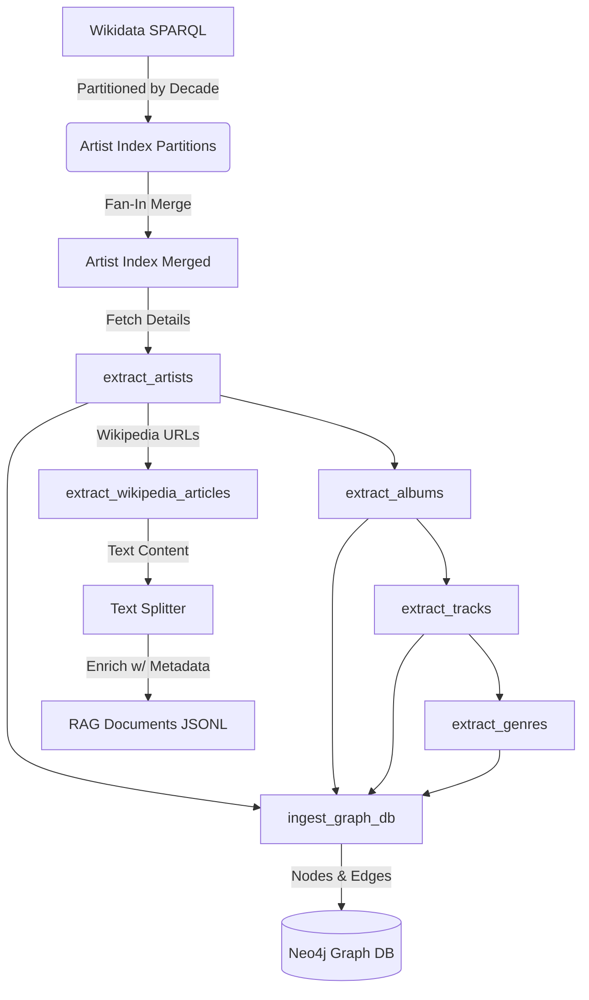
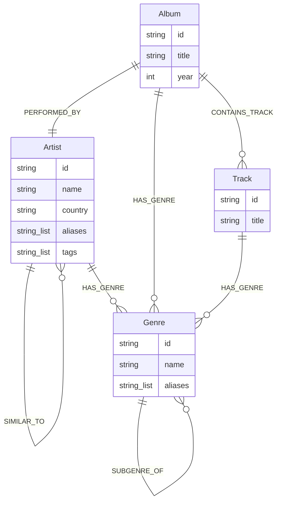

# GraphRAG - Part 1: Data Pipeline

*Last update: January 10, 2026*

This repo is part of a larger project **GraphRAG** app, in which I show how the GraphRAG pattern works. 

Part 1 is a basic Data Pipeline made with **Dagster**, which orchestrates the data ingestion from multiple sources for making a knowledge graph (in **Neo4j** graph database) and an embedding model (in **ChromaDB** vector database) for a RAG system. This app is ready to be deployed on the cloud in a Docker container.

## Domain: Electronic Music

This pipeline is specifically tuned for the **Electronic Music** domain. It captures the rich, interconnected history of electronic artists, from early pioneers to contemporary producers. The dataset encompasses a wide range of sub-genres—including Techno, House, Ambient, IDM, and Drum & Bass—modeling the complex relationships between artists, their releases, and the evolving taxonomy of electronic musical styles.

## About the Project

This data pipeline orchestrates data ingestion from multiple sources to build a rich dataset of music artists:

- **Wikidata API** (using SPARQL & Action API)
- **Wikipedia API** (Text Content)
- **Last.fm API** (Metadata & Tags)

The goal is to prepare unstructured data (Wikipedia articles of musicians, bands, and artists) and split it into chunks enriched with structured metadata. This prepares the data for a hybrid search approach:

1.  **Semantic Search:** Preparing text chunks for vectorization.
2.  **Deterministic Search:** Using **Neo4j** (Graph Database).

We leverage **Polars** for high-performance data transformation, **Pydantic** for rigorous data validation, and **Dagster Resources** for clean infrastructure management.

## Tech Stack

- **Orchestration:** [Dagster](https://dagster.io/) (Assets, Resources, Partitions, Asset Checks)
- **Databases:** [Neo4j](https://neo4j.com/) (Graph), [ChromaDB](https://www.trychroma.com/) (Vector)
- **Data Engineering:** [Polars](https://pola.rs/) (manipulation), [Msgspec](https://github.com/jcrist/msgspec) (serialization), [Ftfy](https://github.com/rspeer/python-ftfy) (cleaning)
- **Data Validation & Config:** [Pydantic](https://pydantic.dev/), [Pydantic Settings](https://docs.pydantic.dev/latest/concepts/pydantic_settings/)
- **AI & ML:** [PyTorch](https://pytorch.org/), [Transformers](https://huggingface.co/docs/transformers/index), [Nomic](https://atlas.nomic.ai/) (Embeddings), [LangChain](https://www.langchain.com/) (Text Splitters), [Einops](https://einops.rocks/)
- **Networking & Utils:** [HTTPX](https://www.python-httpx.org/) (Async), [Structlog](https://www.structlog.org/), [Tqdm](https://tqdm.github.io/)
- **Language & Tooling:** [Python 3.13+](https://www.python.org/), [uv](https://docs.astral.sh/uv/), [Ruff](https://docs.astral.sh/ruff/), [Ty](https://github.com/astral-sh/ty), [Bandit](https://bandit.readthedocs.io/)

## Project Structure (Clean Architecture)

The project follows a layered architecture to separate business logic from orchestration infrastructure, ensuring maintainability and scalability.

### Core Components

*   **`src/data_pipeline/defs/assets/` (The "What")**:
    *   Defines the **Business Logic**. Each file represents a Data Asset (e.g., `artists`, `albums`) and the high-level recipe to create it.
    *   Assets focus on *orchestration*: they declare their dependencies, request resources, and call utility functions to process data.

*   **`src/data_pipeline/defs/resources.py` (The Infrastructure)**:
    *   Defines **Environment Connections**. Handles the lifecycle of connections to Neo4j, External APIs (Wikidata, Last.fm), and file storage.
    *   Allows assets to remain environment-agnostic (swappable between Dev/Prod/Test).

*   **`src/data_pipeline/utils/` (The "How-To")**:
    *   Contains **Reusable, Low-Level Logic**. This is the toolbox used by assets.
    *   **Role 1: Reusability (DRY):** Shared logic like `make_async_request_with_retries` or `normalize_and_clean_text`.
    *   **Role 2: Complexity Hiding:** Encapsulates messy details (SPARQL query construction, JSON parsing, Unicode fixing) to keep Asset files clean and readable.
    *   **Role 3: Testability:** Functions are designed to be "pure" or generic, making them easy to unit test in isolation.
    *   *Key Modules:*
        *   `network_helpers.py`: Transport layer (retries, batching, rate limiting).
        *   `*_helpers.py`: Service wrappers for Wikidata, Last.fm, etc.
        *   `text_transformation_helpers.py`: Domain-agnostic text cleaning (ftfy, regex).
        *   `graph_db_helpers.py`: Cypher query wrappers and index management.

*   **`src/data_pipeline/defs/checks.py` (The Quality Gate)**:
    *   Defines **Automated Data Quality Checks**. Verifies the integrity of assets *after* they are materialized (e.g., "Are there >0 null IDs?", "Is the album count per artist reasonable?").

### The "Use" Hierarchy

1.  **Resources** (`defs/resources.py`): Provide the raw connection (e.g., `httpx.AsyncClient`, `Neo4j Driver`).
2.  **Utils** (`utils/*.py`): Use the connection to perform specific actions (e.g., `fetch_sparql_query`, `clear_database`) or pure data transformations.
3.  **Assets** (`defs/assets/*.py`): Orchestrate the Utils to achieve a business goal (e.g., "Extract Albums").
4.  **Checks** (`defs/checks.py`): Verify the final output of the Assets ensuring data trust.

## Data Architecture

The pipeline transforms raw data from external APIs into two optimized formats: a **Knowledge Graph** (for structural queries) and **Vector-Ready Text Chunks** (for semantic search).

### Pipeline Flow



### 1. Unstructured Data (RAG Preparation)

We process Wikipedia articles to create a high-quality corpus for Retrieval-Augmented Generation (RAG).

- **Ingestion:** Fetches full articles for every valid artist found in the Knowledge Graph.
- **Cleaning:** Removes Wiki-markup, references, and non-text elements (using excluded headers).
- **Chunking:** Splits text into 2048-token windows with 512-token overlap using a recursive character splitter (offloaded to threads for performance).
- **Enrichment:** Each chunk is "stamped" with global metadata (Genre, Year, Artist Name) to allow for hybrid filtering during retrieval (e.g., "Find chunks about 'Techno' from the '90s").

| Field | Type | Description |
| :--- | :--- | :--- |
| `article` | String | The enriched text content prepended with `search_document:`. |
| `metadata` | JSON | Contextual tags: `title`, `artist_name`, `genres`, `inception_year`, `wikipedia_url`. |

### 2. Graph Database (Neo4j)

We construct a deterministic Knowledge Graph to map the relationships between the musical entities. This allows for precise multi-hop queries (e.g., "Find all sub-genres of 'House' that originated in 'France'").

#### Graph Schema



#### Nodes (Entities)
- **Artist:** The core entity (e.g., "Daft Punk").
- **Album:** Major releases linked to artists.
- **Track:** Individual songs linked to albums.
- **Genre:** A hierarchical taxonomy of musical styles (e.g., "French House" -> "House" -> "Electronic").

#### Edges (Relationships)
- `(Artist)-[:HAS_GENRE]->(Genre)`
- `(Artist)-[:SIMILAR_TO]->(Artist)`: Derived from Last.fm community data.
- `(Album)-[:PERFORMED_BY]->(Artist)`
- `(Album)-[:CONTAINS_TRACK]->(Track)`
- `(Album)-[:HAS_GENRE]->(Genre)`
- `(Track)-[:HAS_GENRE]->(Genre)`
- `(Genre)-[:SUBGENRE_OF]->(Genre)`: Enables hierarchical graph traversal.

**Dataset Statistics:**
- **Articles:** ~4,679 processed.
- **Nodes:** ~47,584 (Artists, Releases, Genres).
- **Edges:** ~88,828.

### 3. Vector Database (Chroma)

To enable semantic search, the processed text chunks are indexed in **ChromaDB**.

- **Collection Name:** `music_rag_collection`
- **Embedding Model:** `nomic-embed-text-v1.5` (via Nomic AI)
- **Distance Metric:** Cosine Similarity

The `wikipedia_articles.jsonl` dataset serves as the source of truth. A specialized ingestion process (conceptually part of the RAG pipeline) reads these files, generates embeddings using the Nomic model, and upserts them into the vector store. This allows for natural language queries like "Which electronic artists were influenced by 80s synth-pop?".

## Getting Started

### Prerequisites

- **Python 3.13+**
- [**uv**](https://docs.astral.sh/uv/) (Astral's Python package manager)
- A **Neo4j** instance (Aura cloud or local)

### Installation & Setup

To ensure replicability, follow these steps to set up the environment and dependencies:

1.  **Clone the repository:**
    ```bash
    git clone <repository-url>
    cd graph_rag_data_pipeline_1
    ```

2.  **Install dependencies using `uv`:**
    This will create a virtual environment and install all required packages (including dev dependencies) from `uv.lock`.
    ```bash
    uv sync
    ```

3.  **Configure Environment Variables:**
    The application requires several API keys and database credentials. Create a `.env` file in the root directory and populate it with your keys:
    
    ```env
    # Neo4j Graph Database
    NEO4J_URI=neo4j+s://<your-instance-id>.databases.neo4j.io
    NEO4J_USERNAME=neo4j
    NEO4J_PASSWORD=<your-password>

    # API Keys
    LASTFM_API_KEY=<your-lastfm-api-key>
    NOMIC_API_KEY=<your-nomic-api-key>

    # Optional: Dagster Environment (PROD or DEV)
    DAGSTER_ENV=DEV
    ```

    *Note: You can obtain a free Nomic API key at [atlas.nomic.ai](https://atlas.nomic.ai/) and a Last.fm API key at [last.fm/api](https://www.last.fm/api/account/create).*

### Running the Pipeline

1.  **Activate the virtual environment:**
    ```bash
    source .venv/bin/activate
    ```

2.  **Launch the Dagster development server:**
    This command starts the Dagster UI and allows you to trigger and monitor the pipeline.
    ```bash
    dg dev
    ```

3.  **Execute the Pipeline:**
    *   Open [http://localhost:3000](http://localhost:3000) in your browser.
    *   Navigate to **Assets** -> **Global Asset Graph**.
    *   Click **"Materialize all"** (top right) to run the full end-to-end pipeline.
    *   *Note:* The `build_artist_index_by_decade` asset is partitioned. Dagster will automatically launch 10 parallel runs (one for each decade) and then merge the results in `artist_index`.

### Running Tests

To verify the installation and code integrity, run the test suite:

```bash
uv run pytest
```

### Security and Quality Checks

We use `ruff` for linting and `bandit` for security scanning:

```bash
uv run ruff check .
uv run bandit -r src/
```

## Learn More

- [Dagster Documentation](https://docs.dagster.io/)
- [Neo4j Graph Database](https://neo4j.com/docs/)
- [uv Documentation](https://docs.astral.sh/uv/)
- [Nomic AI Documentation](https://docs.nomic.ai/)